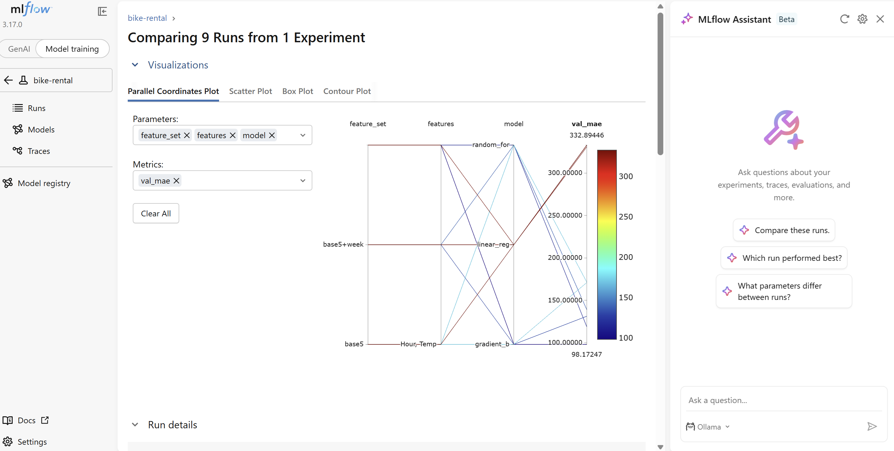

# cloud-mlops-team-1

날씨와 시간 정보로 서울 따릉이의 **시간당 자전거 대여 수**를 예측한다. 대여소 운영자가 시간대별 자전거 배치를 미리 정하는 데 사용하는 것을 목표로 한다.

- 데이터 설명·전처리 규칙: [`data/README.md`](data/README.md)
- 입력(7개): Hour, Temperature(°C), Humidity(%), Rainfall(mm), Holiday, is_weekend(주말 여부), month(월)
  - is_weekend와 month는 Date에서 계산하므로 사용자는 날짜만 알면 된다.
- 정답: Rented Bike Count (시간당 대여 수, 단위: 대)

## 폴더 구조

```
data/raw/            # 원본 CSV (수정하지 않음)
data/processed/      # 전처리 결과 (정제·격리·기록)
docs/                # 열 역할과 처리 규칙
src/preprocess.py    # 전처리
src/train.py         # 학습·평가·모델 저장
models/model.joblib  # 학습된 모델
results/metrics.json # 평가 결과
```

## 실행 방법

저장소 최상위 폴더에서 실행한다.

```sh
# 1. 가상환경과 라이브러리 설치 (처음 한 번)
python3 -m venv .venv
.venv/bin/pip install -r requirements.txt

# 2. 전처리: data/raw → data/processed
python3 src/preprocess.py

# 3. 학습·평가: models/model.joblib, results/metrics.json 생성
.venv/bin/python src/train.py
```

## 학습 방법

- 입력: `data/processed/bike-clean.csv` (8,448행)
- Holiday는 숫자로 바꾼다 (Holiday=1, No Holiday=0).
- Date로 주말 여부 `is_weekend`(토·일=1, 평일=0)와 월 `month`(1~12)를 계산한다.
- 학습용 80% / 시험용 20%로 랜덤 분할한다 (`random_state=42` 고정). 시험용은 학습에 사용하지 않는다.
- 기준선(학습용 평균값으로 예측), 선형회귀, 랜덤포레스트, Gradient Boosting(HistGradientBoosting)을 비교하고, MAE가 가장 낮은 모델을 저장한다.

## 결과

시험용 1,690행 기준. MAE는 평균적으로 몇 대 틀렸는지를 뜻한다.

| 모델 | MAE (대) | 기준선 대비 개선 | R² |
|---|---:|---:|---:|
| 기준선 (학습용 평균) | 519.57 | - | - |
| 선형회귀 | 336.22 | 35.3% | 0.511 |
| 랜덤포레스트 | 114.41 | 78.0% | 0.911 |
| **Gradient Boosting (채택)** | **93.74** | **82.0%** | **0.943** |

### 개선 과정

같은 시험 데이터(1,690행)에서 입력과 모델을 바꿔 가며 비교했다.

| 단계 | 입력 | 모델 | MAE | 기준선 대비 개선 |
|---|---|---|---:|---:|
| 1 | 5개 (Hour, 기온, 습도, 강수량, 공휴일) | 랜덤포레스트 | 168.02 | 67.7% |
| 2 | + 주말 여부 | 랜덤포레스트 | 135.10 | 74.0% |
| 3 | + 월 | 랜덤포레스트 | 114.41 | 78.0% |
| **4** | **+ 월** | **Gradient Boosting** | **93.74** | **82.0%** |

- 주말 여부: 없으면 평일 출근 시간과 주말 아침을 구별하지 못해 두 값의 중간을 예측했다 (평일 8·18시 MAE 493.92 → 380.34).
- 월: 계절(4구분)보다 잘게 나뉘어 같은 계절 안의 차이(예: 3월과 5월)를 반영한다. 계절로 대신하면 Gradient Boosting 기준 79.5%였다.

### 한계

- 시간 순서가 아닌 랜덤 분할을 사용했다. 데이터가 1년치라 같은 달의 데이터가 학습용과 시험용에 섞이므로, 실제 서비스(미래 예측)보다 점수가 좋게 나올 수 있다.
- 학습에 쓴 날씨는 관측값이다. 실제 서비스에서는 예보값을 입력하게 되므로 오차가 더 커질 수 있다.

## 모델 직접 테스트

```sh
.venv/bin/python -c "
import joblib, pandas as pd
model = joblib.load('models/model.joblib')
cols = ['Hour', 'Temperature(°C)', 'Humidity(%)', 'Rainfall(mm)', 'Holiday', 'is_weekend', 'month']
x = [18, 25, 50, 0, 0, 0, 6]  # [시간, 기온, 습도, 강수량, 공휴일(1/0), 주말(1/0), 월(1~12)]
print('예측 대여 수:', round(model.predict(pd.DataFrame([x], columns=cols))[0]), '대')
"
```
## 학습 방법

- 입력: `data/processed/bike-clean.csv` (8,448행)
- Date로 주말 여부 `is_weekend`(토·일=1)와 월 `month`(1~12)를 계산하고, Holiday는 숫자로 바꾼다 (Holiday=1).
- 학습 60% / 검증 20% / 평가 20%로 랜덤 분할한다 (`random_state=42` 고정).
- 입력 3가지(5개 / +주말 / +주말·월) × 모델 3개(선형회귀, 랜덤포레스트, Gradient Boosting) = 9개 실험을 **검증용**으로 비교해 고른다.
- 고른 모델은 **평가용으로 마지막에 한 번만** 채점한다.
- 모든 실험은 MLflow에 기록한다 (`.venv/bin/mlflow ui` → http://127.0.0.1:5000).

## 결과

### 검증용 비교 (MAE, 단위: 대)

| 입력 | 선형회귀 | 랜덤포레스트 | Gradient Boosting |
|---|---:|---:|---:|
| 5개 | 332.89 | 171.58 | 171.01 |
| + 주말 | 332.63 | 139.11 | 131.32 |
| **+ 주말 + 월** | 330.73 | 119.04 | **98.17 (선택)** |



### 평가용 최종 결과 (선택한 모델, 1회)

| 항목 | 값 |
|—|—:|
| MAE | 94.30대 |
| 기준선 대비 개선 | 81.9% |
| R² | 0.942 |

## 예측 API

### 실행

저장소 최상위 폴더에서 실행한다.

```sh
.venv/bin/uvicorn src.api:app
```

Windows: `.\.venv\Scripts\python.exe -m uvicorn src.api:app`

- `GET /health`: 서버·모델 상태
- `POST /predict`: 예측
- 테스트 화면: http://127.0.0.1:8000/docs

### 요청과 응답

요청 (`POST /predict`)

```json
{"date": "2018-06-15", "hour": 18, "temperature": 25.0, "humidity": 50, "rainfall": 0.0, "holiday": false}
```

정상 응답 (200)

```json
{"predicted_rentals": 3313, "unit": "대"}
```

입력 오류 응답 (422)

```json
{"errors": [{"field": "hour", "reason": "시간(0~23 정수)은(는) 0~23이어야 합니다"}]}
```

### 입력 규칙

| 항목 | 규칙 |
|---|---|
| date | YYYY-MM-DD (주말 여부·월은 서버가 계산) |
| hour | 0~23 정수 |
| temperature | -30~45 (°C) |
| humidity | 1~100 (%) |
| rainfall | 0 이상 (mm) |
| holiday | true / false |

숫자처럼 생긴 문자열(`"25"`)과 true/false는 숫자로 받지 않는다.

### 정상·오류 확인 결과

서버를 켠 상태에서 `.venv/bin/python src/check_api.py`로 실제 요청을 보내 확인했다. 모델 준비 실패는 `MODEL_PATH=models/no-model.joblib`로 서버를 켠 뒤 `--cases model-missing`으로 확인했다. 응답 원문은 `results/api-check.json`, `results/api-check-model-missing.json`에 있다.

| 상황 | 상태 코드 | 응답 |
|---|---:|---|
| 서버 상태 확인 | 200 | `status: ok` |
| 정상 입력 | 200 | 예측 3,313대 |
| 시간 25 | 422 | hour 범위 오류 |
| 습도에 문자 | 422 | humidity 숫자 아님 |
| 강수량 누락 | 422 | rainfall 필수 항목 없음 |
| 모델 파일 없음 | 503 | 모델을 읽지 못함 |
